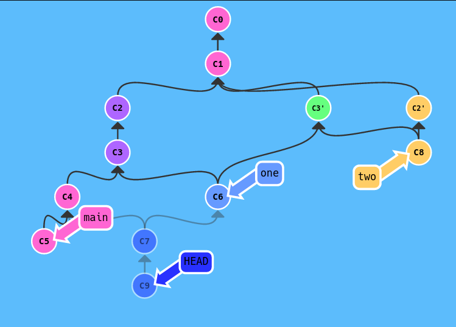

Sprawdzian nr 2 PWI 2020
=======================
Macie do wykonania dwa proste zadania. Wyniki swojej pracy powinniście umieścić w mini-sprawozdaniu sformatowanym według standardu *Markdown*.

Zadanie 1
---------

Obrazek mówi sam za siebie i chodzi oczywiście by stworzyć podobny przy użyciu znanej Wam już [strony](https://learngitbranching.js.org/?NODEMO). 
W sprawozdaniu poza wynikowym zrzutem ekranu napiszcie listę komend, która doprowadziła Was do finalnego rezultatu.

Zadanie 2
---------
W pliku _zadanie2.txt_ znajdują się zahashowane(SHA256) numery indeksów. Należy dowolnymi poleceniami
+ odnaleźć swój numer 
+ dowiedzieć się który commit *dodał* tę linijkę do pliku
+ przejść do tego commita 
+ utworzyć nową gałąź i commit w którym umieścić należy sprawozdanie ze sprawdzianu
+ zrobić pull-request do oryginalnego repozytorium z tym commitem
