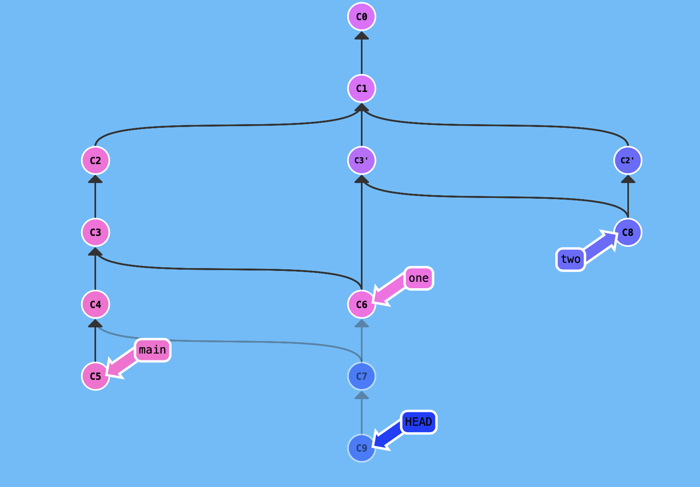

Gordian Czerkawski(324534) - Sprawdzian nr 2 PWI 2020
=======================
Zadanie 1
---------

Komendy wykorzystane utworzenia repozytorium z obrazka:
+ git commit
+ git commit
+ git commit
+ git commit
+ git checkout C1
+ git branch one
+ git checkout one
+ git cherry-pick C3
+ git merge C3
+ git checkout C6
+ git merge C4
+ git checkout C2
+ git branch two
+ git checkout two
+ git cherry-pick C2
+ git merge C3'
+ git checkout C7
+ git commit

Zadanie 2
---------
Znajduje hash mojego indeksu komendą:
+ echo -n  '324534' | shasum -a 256   
Wynik to: '3288658ddc197b4bec6165e68a75961ed5928c8263aa3f7450934433eb27f0ff.
Znajduje linijkę w której jest mój numer: 
+  grep -n '3288658ddc197b4bec6165e68a75961ed5928c8263aa3f7450934433eb27f0ff' zadanie2.txt
Jest to linijka 380.
Komita znajduje komendą:
+ git blame 'zadanie2.txt'| grep '3288658ddc197b4bec6165e68a75961ed5928c8263aa3f7450934433eb27f0ff'
Jest to komit: '2c95b732'. Przechodzę do niego checkoutem. Tworzę gałąź 'nowa'. Tworzę na niej komit ze sprawozdaniem.
