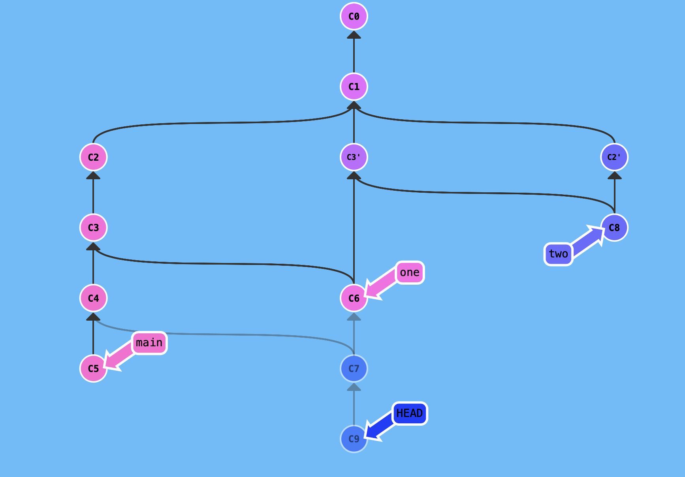

Gordian Czerkawski(324534) - Sprawdzian nr 2 PWI 2020
=======================
Zadanie 1
---------

Komendy wykorzystane utworzenia repozytorium z obrazka:
+git commit
+git commit
+git commit
+git commit
+git checkout C1
+git branch one
+git checkout one
+git cherry-pick C3
+git merge C3
+git checkout C6
+git merge C4
+git checkout C2
+git branch two
+git checkout two
+git cherry-pick C2
+git merge C3'
+git checkout C7
+git commit
